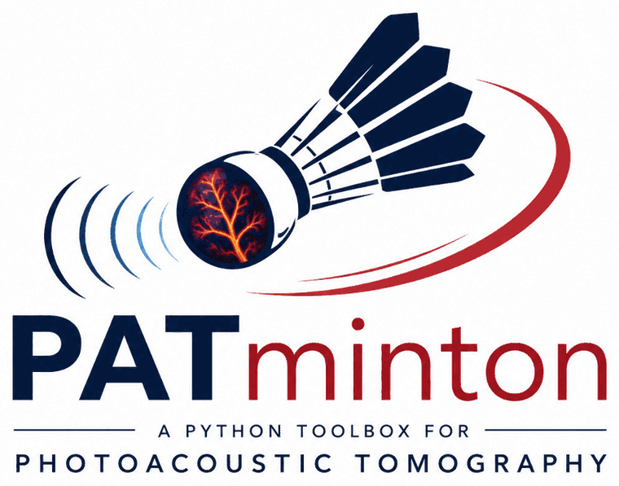

<p align="center">
  
</p>

<p align="center">
  <a href="https://patminton.readthedocs.io/"></a>
</p>

# patminton — GPU-Accelerated 3D Photoacoustic Tomography

CUDA implementations of the forward and adjoint operators of 3D
photoacoustic tomography (PAT) as on-the-fly matrix-vector products, for
iterative image reconstruction without storing the system matrix, plus
CGLS, L-BFGS-B, PGD and Chambolle-Pock TV solvers built on top of them.

For a 201³ grid observed by 11 520 transducer positions with 1000 time samples,
the dense system matrix would occupy 201³ × 11 520 × 1000 × 8 B ≈ 750 TB in double
precision; `patminton` applies it and its adjoint on the fly on the GPU instead.

## Installation

```bash
pip install patminton
```

Requirements: a CUDA-capable NVIDIA GPU (compute capability ≥ 7.0) and
Python ≥ 3.9. On Linux x86-64 this installs a prebuilt wheel and needs no
CUDA toolkit; if cuFFT is not already provided by a toolkit or by PyTorch,
add the extra matching the build (`pip install patminton[cuda12]`).

Installing from source instead requires the CUDA toolkit (`nvcc` ≥ 11 on
PATH), which compiles the library for every supported architecture. To target
a specific set of GPUs (e.g. V100 + A100 + RTX 30xx):

```bash
PATMINTON_CUDA_ARCH="70;80;86" pip install --no-binary patminton patminton
```

## Quick example

```python
import torch
from patminton import PAT, translation_rotation_system, least_squares_CG

infos = translation_rotation_system(
    transducer_radius=25e-3, transducer_height=7.5e-3,
    transducer_width=0.250e-3, transducer_pitch=0.298e-3,
    transducer_nbr_elements=64, transducer_wavelength=1500/5e6,
    grid_size=10e-3,
)

pat = PAT(201, 201, 201, 5e-3, 5e-3, 5e-3,
          nT=1024, tStart=12.5e-6, dt=16e-9, c=1500.0,
          mode='cylinder_lut', infos_transducers=infos)

p = torch.zeros((201, 201, 201), dtype=torch.float64, device='cuda')
p[100, 100, 100] = 1.0

s = pat @ p                     # forward:  signals from initial pressure
p_bp = pat.T @ s                # adjoint:  back-propagation

u, *_ = least_squares_CG(pat, s, M_inv=None, max_iter=50, lam=1e-4)
```

## Documentation

**[patminton.readthedocs.io](https://patminton.readthedocs.io/)** — installation, quickstart, physical and
mathematical model, transducer models, reconstruction algorithms and key
parameters.

To preview it locally:

```bash
pip install -r docs/requirements.txt
mkdocs serve      # live preview on http://127.0.0.1:8000
```

## Tests

```bash
pip install .[test]
pytest              # CPU tests (no GPU needed)
pytest -m gpu       # operator tests on a CUDA GPU
```

## Reference

The on-the-fly matrix-vector product strategy follows:

> Lu Ding, Daniel Razansky, Xosé Luís Deán-Ben —
> *"Model-based reconstruction of large three-dimensional optoacoustic
> datasets"*, IEEE Transactions on Medical Imaging, 2020.

If you use this package, please cite:

> Trung-Thai Do, Paul Escande, Caroline Chaux, Jérôme Gateau, Hwee Kuan Lee —
> *"Implementations of photoacoustic tomography models"*, 2026.
